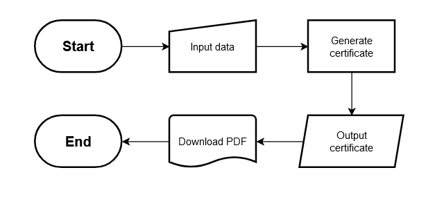
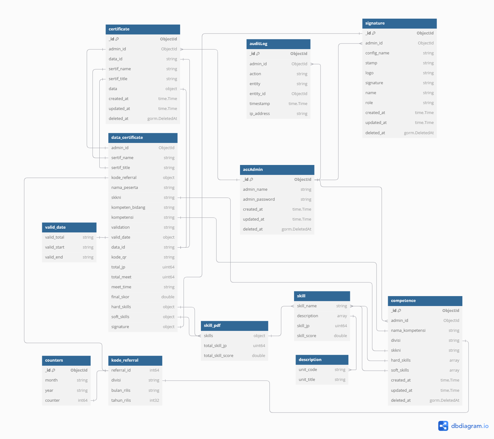

# Certificate Generator

Certificate Generator is a web application that automatically creates a certificate from a given template. You just need to input the data.

## Features

- Account login system
- Certificate, Competence, and Signature creation, reading, updating, and deletion
- Automatic certificate generation
- QR Code generation that links the certificate to a custom page in the app

## How It Works

- [Go Fiber](https://github.com/gofiber/fiber) for handling API

Each handler validates the given data, then processes and returns the processed data from the given data.

- [wkhtmltopdf](https://wkhtmltopdf.org/) for PDF creation

The given data is rendered into a HTML template, then converted into PDF using wkhtmltopdf.

- [MongoDB](https://www.mongodb.com) for app database

Certificates, Competences, and Signatures made are stored in MongoDB.

- [Caddy](https://caddyserver.com/) for app reverse proxy

Reverse proxy is used to bundle the app under one host and to increase security.

## Flowchart Design

## Database Structure Design

## Contributors
### Backend:
[Pande](https://github.com/Pande17)  
[Lanang](https://github.com/Lanang-Dhirendra)
### Frontend:
[Rendy](https://github.com/erza-503)  
[Lian](https://github.com/KadekLiantini)